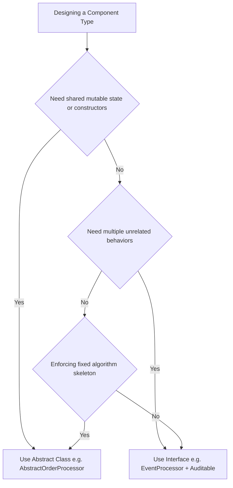

# Advanced Java Mastery & Domain Design Learnings

---

## 1. Advanced Java Language Mechanics (Java 8 to 21+)

### Interfaces (Java 8 & 9+)
- **`default` Methods**: Provide default instance method implementations in interfaces. Used to resolve interface default method signature collision diamond problems: [Auditable.super.getAuditHeader()](./processor/AbstractOrderProcessor.java#L69).
- **`static` Methods**: Belong directly to the interface type namespace: [EventProcessor.getSystemVersion()](./contracts/EventProcessor.java#L47).
- **`private` Helper Methods (Java 9+)**: Used inside interfaces to encapsulate shared string formatting between `default` methods without exposing them to implementing classes: [formatEvent(...)](./contracts/EventProcessor.java#L30).

### Sealed Types & Records (Java 17+)
- **Sealed Interfaces (`sealed ... permits`)**: Restrict implementation strictly to permitted types listed after `permits` ([PaymentMethod](./contracts/PaymentMethod.java#L10-L14)), enabling compile-time exhaustiveness.
- **Implementer Rules**: Every permitted implementer MUST be declared as `final` (or `record`), `sealed`, or `non-sealed`. Implementers do **not** need to be nested—they can be standalone `.java` files in the same package.
- **Records**: Immutable data containers ([CreditCard](./contracts/PaymentMethod.java#L21)) with auto-generated getters, `equals()`, `hashCode()`, and `toString()`. Records are implicitly `final`.
- **Compact Constructor**: Syntax `public CreditCard { ... }` ([CreditCard Compact Constructor](./contracts/PaymentMethod.java#L24-L44)) without `(...)` parameter list or `this.x = x` boilerplate. Used strictly for input validation and normalization before implicit field assignment.

### Pattern Matching for `instanceof` (Java 16+)
- Combines type checking and downcasting into a single line: [if (cc instanceof PaymentMethod.CreditCard card)](./Main.java#L118).
- **Flow Scoping**: The pattern variable `card` is in scope **only** inside the block where the type check is guaranteed `true`.
- **Exhaustive `switch` Expressions (Java 21+)**: Allows pattern-matching `switch` over sealed types **without needing a `default:` fallback case**.

### `@FunctionalInterface` & SAM Rule
- Enforces the **Single Abstract Method (SAM)** rule for lambda compatibility: [RiskEvaluator](./contracts/RiskEvaluator.java#L11-L18).
- Declaring a 2nd abstract method triggers a compiler error. However, `default`, `static`, and `Object` methods do not violate SAM.

---

## 2. OOP Architecture & Modifiers

### Abstract Class vs. Interface Decision Framework



1. **State & Lifecycle (`Is-A` vs `Can-Do`)**:
   - Use an **Abstract Class** ([AbstractOrderProcessor](./processor/AbstractOrderProcessor.java#L18)) when classes share identity, state (`processorId`), and constructors.
   - Use an **Interface** ([Auditable](./contracts/Auditable.java#L8)) when unrelated classes share a behavioral capability.
2. **Template Method Pattern**:
   - Abstract classes enforce fixed algorithm execution order: [process(...)](./processor/AbstractOrderProcessor.java#L35).

### Variable Modifiers (`static`, `final`, Instance)
- `protected String id;` -> **Mutable Instance Field**: Unique per object instance, re-assignable.
- `protected final String id;` ([AbstractOrderProcessor.java:L20](./processor/AbstractOrderProcessor.java#L20)) -> **Immutable Instance Field**: Unique per object instance, assigned **exactly once** during construction.
- `public static final String VER;` -> **Global Class Constant**: Stored once in Class metadata.
- **Single Assignment Rule**: A `final` field can **NEVER** be assigned twice—not even within the same constructor or across constructor chaining.

### Fluent Builder Pattern (`Order.Builder`) vs Protobuf
- **Fluent Builder**: Uses field-named methods ([Order.Builder](./model/Order.java#L96-L128)) without `set` prefixes for clean readable domain assembly. Getters belong on the constructed immutable object ([Order](./model/Order.java#L1-L90)), not the transient builder.
- **Protobuf Builder**: Uses `set...()` and `get...()` on the builder because Protobuf builders double as mutable inspection buffers during serialization.

---

## 3. Java Runtime Mechanics & Exception Handling

### `Error` vs. `Exception` Intuition Framework

```text
               Is the failure caused by App Logic or Data?
                                    │
                     ┌──────────────┴──────────────┐
                     ▼                             ▼
               YES -> Exception              NO -> Error
         (Application-Level Fault)        (JVM / System Fault)
         -------------------------        --------------------
         • User passed invalid price      • RAM is 100% full (OOM)
         • File not found on disk         • Infinite recursion filled stack
         • DB connection timeout          • Binary class missing from JAR
                     │                             │
                     ▼                             ▼
            Action: RECOVER               Action: CRASH & RESTART
            (Retry, fallback,             (Restart pod, adjust JVM
             return HTTP 400/500)          flags -Xmx, fix classpath)
```

- **Production Best Practice**: Never catch `Error` or `Throwable` in global web exception handlers (Spring `@ControllerAdvice`). A corrupted JVM should crash so container orchestrators (Docker/Kubernetes) can restart a fresh instance.
- **Package Execution**: Classes declared under `package language;` must be compiled and executed from the root classpath directory (`~/Documents/algorithms/java`) via `java language.Main`.

### Checked vs Unchecked Exceptions
- **Checked Exception**: Extends `Exception` directly ([OrderProcessingException](./exception/OrderProcessingException.java#L7)). Compiler mandates declaring `throws` on method signatures or handling via `try-catch`.
- **Unchecked Exception**: Extends `RuntimeException` (e.g. `IllegalArgumentException`). Used for programming errors or invalid input state; does not require `throws` method signatures.

---

## 4. Generics, PECS & Functional Interface Syntax Decoding

### Generic Type Parameter Declarations (`public static <T>`)
- Writing `<T>` before a static method's return type introduces `T` as a generic placeholder parameter scoped to that method execution.
- **Type Erasure (`new T()`)**: Instantiating generic placeholders like `new T()` is illegal in Java because type information is erased at runtime by the compiler.

### PECS Principle (Producer Extends, Consumer Super)
PECS evaluates parameters from the perspective of **YOUR METHOD'S OPERATION**:

```text
  [ results List ]   ──READS FROM──>   YOUR METHOD   ──WRITES INTO──>   [ destination List ]
    (PRODUCER)                                                             (CONSUMER)
```

- **Producer (`? extends T`)**: Parameter provides data *for your method to read*: [extractAllPayloads(...)](./model/ProcessingResult.java#L43). You cannot write/add elements to a `? extends` list.
- **Consumer (`? super T`)**: Parameter receives data *written by your method*: [copyResults(...)](./model/ProcessingResult.java#L59).
- **Dual-Wildcard Methods**: Transferring items between collections uses both wildcards together:
  `public static <T> void copy(List<? extends T> source, List<? super T> destination)`

### Decoding Functional Interface Generics
- **`Function<T, R>`**: Accepts **1 input parameter** of type `T` and returns **1 output** of type `R` (`<InputType, OutputType>`).
- **`BiFunction<T, U, R>`**: Accepts **2 input parameters** (`T`, `U`) and returns **1 output** of type `R`.

---

## 5. Enums, Nested Classes & Modern Date Parsing

### Enum Constant-Specific Class Bodies
- Declaring an `abstract` method inside an `enum` ([OrderStatus](./model/OrderStatus.java#L72)) forces every enum constant to implement its own specific behavior inside `{ ... }` blocks, creating self-validating state machines.

### Non-Static Inner Classes vs Static Nested Classes
- **Static Nested Class**: Instantiated independently (`new Order.Builder("ORD-101")`). Does not hold an implicit reference to the outer class.
- **Non-Static Inner Class**: Bound to a specific outer instance. Instantiated from the outside using `outerInstance.new InnerClass()` ([order.new OrderAuditTracker()](./Main.java#L148)).
- **Inner Class Access Modifiers**: `public` allows outside instantiation via `outer.new`; `private` encapsulates the inner class completely (e.g. `private static class Node` in data structures).

### Modern Date Parsing (`java.time.YearMonth`)
- Deprecated `new Date(String)` string parsing fails on short formats like `"12/28"`.
- Use modern `java.time.YearMonth.parse(expiryDate, DateTimeFormatter.ofPattern("MM/yy"))` ([PaymentMethod.CreditCard](./contracts/PaymentMethod.java#L40-L44)).

---

## 6. Stealth Domain-Driven Data Structure Practice Suite (`language.ds`)

Seven domain feature modules framed strictly through real-world operational constraints:

1. **[OrderActionTracker.java](./ds/OrderActionTracker.java#L25)**: **LIFO** State Reversal Stack (`Deque.push() / pop()`).
2. **[OrderFulfillmentDispatcher.java](./ds/OrderFulfillmentDispatcher.java#L25)**: **FIFO** Order Dispatch Queue (`Queue.offer() / poll()`).
3. **[AuditTrailContainer.java](./ds/AuditTrailContainer.java#L25)**: **Double-ended** Event Stream (`LinkedList.addFirst() / addLast()`).
4. **[TransactionIdempotencyRegistry.java](./ds/TransactionIdempotencyRegistry.java#L24)**: **`O(1)`** Duplicate Guard (`HashSet.add() / contains()`).
5. **[PriorityFulfillmentEngine.java](./ds/PriorityFulfillmentEngine.java#L26)**: **Priority** Urgency Dispatcher (`PriorityQueue` with `Comparator`).
6. **[CatalogPriceIndexer.java](./ds/CatalogPriceIndexer.java#L24)**: **`O(log N)` Sorted Price Range Query** (`TreeMap.subMap()`).
7. **[EvaluationCacheEngine.java](./ds/EvaluationCacheEngine.java#L23)**: **`O(1)` LRU Risk Cache Eviction** (`LinkedHashMap` with `accessOrder = true`).
