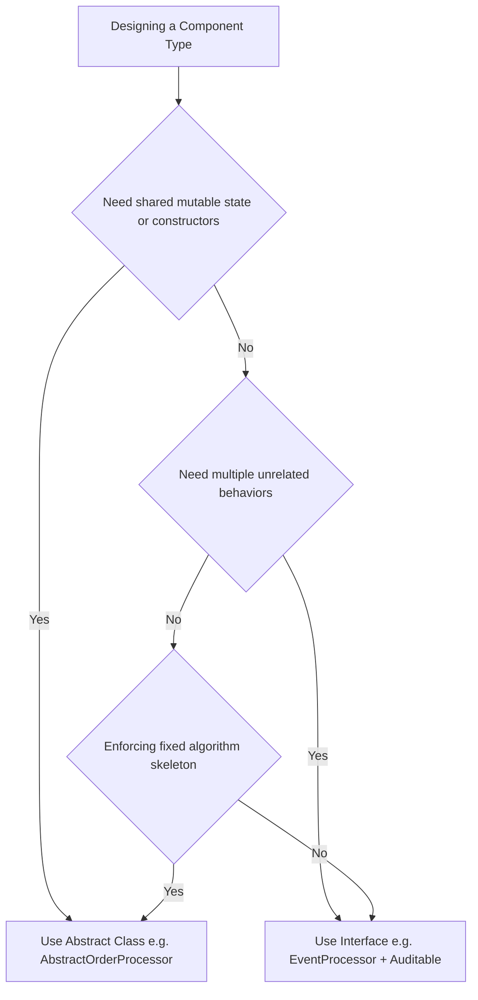

# Advanced Java Mastery & Domain Design Learnings

---

## 1. Advanced Java Language Mechanics (Java 8 to 21+)

### Interfaces (Java 8 & 9+)
- **`default` Methods**: Provide default instance method implementations in interfaces. Used to resolve interface default method signature collision diamond problems: [Auditable.super.getAuditHeader()](./processor/AbstractOrderProcessor.java#L69).
- **`static` Methods**: Belong directly to the interface type namespace: [EventProcessor.getSystemVersion()](./contracts/EventProcessor.java#L47).
- **`private` Helper Methods (Java 9+)**: Used inside interfaces to encapsulate shared string formatting between `default` methods without exposing them to implementing classes: [formatEvent(...)](./contracts/EventProcessor.java#L30).

### Sealed Types & Records (Java 17+)
- **Sealed Interfaces (`sealed ... permits`)**: Restrict implementation strictly to permitted types listed after `permits` ([PaymentMethod](./contracts/PaymentMethod.java#L10-L14)), enabling compile-time exhaustiveness.
- **Implementer Rules**: Every permitted implementer MUST be declared as `final` (or `record`), `sealed`, or `non-sealed`. Implementers do **not** need to be nested—they can be standalone `.java` files in the same package.
- **Records**: Immutable data containers ([CreditCard](./contracts/PaymentMethod.java#L21)) with auto-generated getters, `equals()`, `hashCode()`, and `toString()`. Records are implicitly `final`.
- **Compact Constructor**: Syntax `public CreditCard { ... }` ([CreditCard Compact Constructor](./contracts/PaymentMethod.java#L24-L44)) without `(...)` parameter list or `this.x = x` boilerplate. Used strictly for input validation and normalization before implicit field assignment.

### Pattern Matching for `instanceof` (Java 16+)
- Combines type checking and downcasting into a single line: [if (cc instanceof PaymentMethod.CreditCard card)](./Main.java#L118).
- **Flow Scoping**: The pattern variable `card` is in scope **only** inside the block where the type check is guaranteed `true`.
- **Exhaustive `switch` Expressions (Java 21+)**: Allows pattern-matching `switch` over sealed types **without needing a `default:` fallback case**.

### `@FunctionalInterface` & SAM Rule
- Enforces the **Single Abstract Method (SAM)** rule for lambda compatibility: [RiskEvaluator](./contracts/RiskEvaluator.java#L11-L18).
- Declaring a 2nd abstract method triggers a compiler error. However, `default`, `static`, and `Object` methods do not violate SAM.

---

## 2. OOP Architecture & Modifiers

### Abstract Class vs. Interface Decision Framework



1. **State & Lifecycle (`Is-A` vs `Can-Do`)**:
   - Use an **Abstract Class** ([AbstractOrderProcessor](./processor/AbstractOrderProcessor.java#L18)) when classes share identity, state (`processorId`), and constructors.
   - Use an **Interface** ([Auditable](./contracts/Auditable.java#L8)) when unrelated classes share a behavioral capability.
2. **Template Method Pattern**:
   - Abstract classes enforce fixed algorithm execution order: [process(...)](./processor/AbstractOrderProcessor.java#L35).

### Variable & Field Modifiers (`static`, `final`, `transient`, `volatile`)

| Modifier | Primary Function / Guarantee | Serialization Behavior | Memory / Threading Behavior |
| :--- | :--- | :--- | :--- |
| **`final`** | **Immutability & Single Assignment**: Assigned exactly once during initialization. | Serialized normally | Thread-safe published state after constructor completion |
| **`transient`** | **Serialization Exclusion**: Skips field during byte-stream encoding. | **Skipped** (resets to `null`/`0`/`false` on deserialization) | Standard heap variable |
| **`volatile`** | **Visibility Guarantee**: Flushes reads/writes directly to/from main RAM. | Serialized normally | Bypasses per-core L1/L2 caches; prevents instruction reordering |
| **`static`** | **Class-Level Scope**: Shared across all instances of a class. | Not serialized with instance state | Resides once in Metaspace |

1. **`protected String id;`** -> **Mutable Instance Field**: Unique per object instance, re-assignable.
2. **`protected final String id;`** ([AbstractOrderProcessor.java:L20](./processor/AbstractOrderProcessor.java#L20)) -> **Immutable Instance Field**: Unique per object instance, assigned **exactly once** during construction.
3. **`public static final String VER;`** -> **Global Class Constant**: Stored once in Class metadata.
4. **`transient` Keyword**:
   - Used to mark sensitive fields (passwords, encryption keys, credit card CVVs), temporary calculation caches, or non-serializable system handles (database connections, sockets, threads) so Java's `ObjectOutputStream` ignores them.
   - When deserialized via `ObjectInputStream`, `transient` fields receive default primitive/reference values (`null` for objects, `0` for numbers, `false` for booleans).
5. **`volatile` Keyword**:
   - Ensures that updates made by one thread are **immediately visible to all other threads** by forcing reads/writes directly to main memory rather than local CPU L1/L2 caches.
   - **Crucial Distinction (`volatile` vs. `synchronized`)**: `volatile` guarantees **visibility**, but it does **NOT** guarantee **atomicity**. For example, `volatile int count; count++;` is NOT thread-safe because `count++` consists of 3 distinct steps (read, increment, write). For atomic compound operations, use `AtomicInteger` or `synchronized`.

### Fluent Builder Pattern (`Order.Builder`) vs Protobuf
- **Fluent Builder**: Uses field-named methods ([Order.Builder](./model/Order.java#L96-L128)) without `set` prefixes for clean readable domain assembly. Getters belong on the constructed immutable object ([Order](./model/Order.java#L1-L90)), not the transient builder.
- **Protobuf Builder**: Uses `set...()` and `get...()` on the builder because Protobuf builders double as mutable inspection buffers during serialization.

---

## 3. Java Runtime Mechanics & Exception Handling

### `Error` vs. `Exception` Intuition Framework

```text
               Is the failure caused by App Logic or Data?
                                    │
                     ┌──────────────┴──────────────┐
                     ▼                             ▼
               YES -> Exception              NO -> Error
         (Application-Level Fault)        (JVM / System Fault)
         -------------------------        --------------------
         • User passed invalid price      • RAM is 100% full (OOM)
         • File not found on disk         • Infinite recursion filled stack
         • DB connection timeout          • Binary class missing from JAR
                     │                             │
                     ▼                             ▼
            Action: RECOVER               Action: CRASH & RESTART
            (Retry, fallback,             (Restart pod, adjust JVM
             return HTTP 400/500)          flags -Xmx, fix classpath)
```

- **Production Best Practice**: Never catch `Error` or `Throwable` in global web exception handlers (Spring `@ControllerAdvice`). A corrupted JVM should crash so container orchestrators (Docker/Kubernetes) can restart a fresh instance.
- **Package Execution**: Classes declared under `package language;` must be compiled and executed from the root classpath directory (`~/Documents/algorithms/java`) via `java language.Main`.

### Checked vs Unchecked Exceptions
- **Checked Exception**: Extends `Exception` directly ([OrderProcessingException](./exception/OrderProcessingException.java#L7)). Compiler mandates declaring `throws` on method signatures or handling via `try-catch`.
- **Unchecked Exception**: Extends `RuntimeException` (e.g. `IllegalArgumentException`). Used for programming errors or invalid input state; does not require `throws` method signatures.

---

## 4. Generics, PECS & Functional Interface Syntax Decoding

### Generic Type Parameter Declarations (`public static <T>`)
- Writing `<T>` before a static method's return type introduces `T` as a generic placeholder parameter scoped to that method execution.
- **Type Erasure (`new T()`)**: Instantiating generic placeholders like `new T()` is illegal in Java because type information is erased at runtime by the compiler.

### PECS Principle (Producer Extends, Consumer Super)
PECS evaluates parameters from the perspective of **YOUR METHOD'S OPERATION**:

```text
  [ results List ]   ──READS FROM──>   YOUR METHOD   ──WRITES INTO──>   [ destination List ]
    (PRODUCER)                                                             (CONSUMER)
```

- **Producer (`? extends T`)**: Parameter provides data *for your method to read*: [extractAllPayloads(...)](./model/ProcessingResult.java#L43). You cannot write/add elements to a `? extends` list.
- **Consumer (`? super T`)**: Parameter receives data *written by your method*: [copyResults(...)](./model/ProcessingResult.java#L59).
- **Dual-Wildcard Methods**: Transferring items between collections uses both wildcards together:
  `public static <T> void copy(List<? extends T> source, List<? super T> destination)`

### Decoding Functional Interface Generics
- **`Function<T, R>`**: Accepts **1 input parameter** of type `T` and returns **1 output** of type `R` (`<InputType, OutputType>`).
- **`BiFunction<T, U, R>`**: Accepts **2 input parameters** (`T`, `U`) and returns **1 output** of type `R`.

---

## 5. Enums, Nested Classes & Modern Date Parsing

### Enum Constant-Specific Class Bodies
- Declaring an `abstract` method inside an `enum` ([OrderStatus](./model/OrderStatus.java#L72)) forces every enum constant to implement its own specific behavior inside `{ ... }` blocks, creating self-validating state machines.

### Non-Static Inner Classes vs Static Nested Classes
- **Static Nested Class**: Instantiated independently (`new Order.Builder("ORD-101")`). Does not hold an implicit reference to the outer class.
- **Non-Static Inner Class**: Bound to a specific outer instance. Instantiated from the outside using `outerInstance.new InnerClass()` ([order.new OrderAuditTracker()](./Main.java#L148)).
- **Inner Class Access Modifiers**: `public` allows outside instantiation via `outer.new`; `private` encapsulates the inner class completely (e.g. `private static class Node` in data structures).

### Modern Date Parsing (`java.time.YearMonth`)
- Deprecated `new Date(String)` string parsing fails on short formats like `"12/28"`.
- Use modern `java.time.YearMonth.parse(expiryDate, DateTimeFormatter.ofPattern("MM/yy"))` ([PaymentMethod.CreditCard](./contracts/PaymentMethod.java#L40-L44)).

---

## 6. Stealth Domain-Driven Data Structure Practice Suite (`language.ds`)

Seven domain feature modules framed strictly through real-world operational constraints:

1. **[OrderActionTracker.java](./ds/OrderActionTracker.java#L25)**: **LIFO State Reversal Stack** (`Deque.push() / pop()`). Used for step-by-step transaction undo/rollback.
2. **[OrderFulfillmentDispatcher.java](./ds/OrderFulfillmentDispatcher.java#L25)**: **FIFO Order Dispatch Queue** (`Queue.offer() / poll()`). Guarantees strict arrival-order processing.
3. **[AuditTrailContainer.java](./ds/AuditTrailContainer.java#L25)**: **Double-ended Event Stream** (`LinkedList.addFirst() / addLast()`). Enables $O(1)$ head insertion for urgent security alerts alongside $O(1)$ tail audit logs.
4. **[TransactionIdempotencyRegistry.java](./ds/TransactionIdempotencyRegistry.java#L24)**: **$O(1)$ Duplicate Guard** (`HashSet.add() / contains()`). Prevents double-billing on retried web requests.
5. **[PriorityFulfillmentEngine.java](./ds/PriorityFulfillmentEngine.java#L26)**: **Priority Urgency Dispatcher** (`PriorityQueue` with `Comparator`). Automatically extracts highest-value orders first in $O(\log N)$ time.
6. **[CatalogPriceIndexer.java](./ds/CatalogPriceIndexer.java#L24)**: **$O(\log N)$ Sorted Price Range Query** (`TreeMap.subMap()`). Performs range queries over prices without full collection scans.
7. **[EvaluationCacheEngine.java](./ds/EvaluationCacheEngine.java#L23)**: **$O(1)$ LRU Risk Cache Eviction** (`LinkedHashMap` with `accessOrder = true`). Automatically purges least-recently accessed risk scores when capacity limit is reached.

---

## 7. Telemetry Engine, JVM Performance & Reflection (`language.telemetry`)

### String Pool Interning (`.intern()`)
- `new String("SUCCESS")` creates an explicit heap object, so identity comparison `s1 == s2` evaluates to `false`.
- Calling `s1.intern()` returns the canonical reference from the JVM String Pool, making `s1.intern() == s2` evaluate to `true` ([TelemetryEngine.java:L29-L37](./telemetry/TelemetryEngine.java#L29-L37)).

### Asynchronous Fault Isolation (`Thread.UncaughtExceptionHandler`)
- Runtime exceptions inside background worker threads do not crash the main thread if isolated with `thread.setUncaughtExceptionHandler((t, e) -> ...)` ([TelemetryEngine.java:L47-L60](./telemetry/TelemetryEngine.java#L47-L60)).
- Essential for telemetry sensors, background loggers, and microservice worker pools.

### Primitive Arrays vs. Boxed Collections Benchmark & CPU Cache Locality
- `double[]` stores primitive numbers contiguously in memory with **0 object header overhead**, maximizing CPU L1/L2 cache line hits.
- `List<Double>` stores pointers to heap-allocated `Double` object wrappers (24-byte object header + 8-byte reference pointer per entry), causing pointer indirection and CPU cache misses ([TelemetryEngine.java:L68-L94](./telemetry/TelemetryEngine.java#L68-L94)).

### Dynamic Reflection & Private Method Invocation
- `Class<?> clazz = target.getClass();` inspects object metadata at runtime.
- `Method method = clazz.getDeclaredMethod("methodName");` retrieves non-public method references.
- `method.setAccessible(true);` bypasses standard Java access modifiers to invoke private diagnostic methods dynamically ([TelemetryEngine.java:L104-L115](./telemetry/TelemetryEngine.java#L104-L115)).

### Custom Spliterator & Parallel Stream Decomposition (`CustomSpliterator`)
- **`Spliterator<T>` (Splitable Iterator)**: Introduced in Java 8 to support parallel data partitioning and stream processing over custom data structures.
- **`tryAdvance(Consumer action)`**: Combines `hasNext()` check and `next()` element retrieval into a single operation, eliminating double bounds checking ([CustomSpliterator.java:L36-L43](./telemetry/CustomSpliterator.java#L36-L43)).
- **`trySplit()`**: Divides the dataset in half (`mid = (origin + fence) >>> 1`) and returns a new `CustomSpliterator` covering the prefix range `[origin, mid)` while the original spliterator updates its range to `[mid, fence)` ([CustomSpliterator.java:L56-L65](./telemetry/CustomSpliterator.java#L56-L65)).
- **Characteristics Flags (`ORDERED | SIZED | SUBSIZED | IMMUTABLE`)**: Informs the JVM Stream execution engine of structural properties so it can optimize execution (e.g. avoiding unnecessary sorting or dynamic array re-allocations).

---

## 8. Built-in Functional Interfaces & Anonymous Classes (`language.functional`)

### The 6 Core Built-In Functional Interfaces

| Interface | Method Signature | Purpose / Domain Use Case | Implementation Example |
| :--- | :--- | :--- | :--- |
| **`Predicate<T>`** | `boolean test(T t)` | Evaluates a boolean condition | [isHighValueOrder](./functional/FunctionalPracticeSuite.java#L36-L39) |
| **`Consumer<T>`** | `void accept(T t)` | Consumes data, produces side-effect (logging, metrics) | [auditLogger](./functional/FunctionalPracticeSuite.java#L49-L52) |
| **`Supplier<T>`** | `T get()` | Lazy value generation (UUIDs, timestamps) | [transactionIdSupplier](./functional/FunctionalPracticeSuite.java#L62-L65) |
| **`Function<T, R>`** | `R apply(T t)` | Transforms input type `T` into output type `R` | [orderSummaryTransformer](./functional/FunctionalPracticeSuite.java#L76-L79) |
| **`UnaryOperator<T>`** | `T apply(T t)` | Special `Function<T, T>` where input & output types match | [surchargeOperator](./functional/FunctionalPracticeSuite.java#L89-L92) |
| **`BinaryOperator<T>`**| `T apply(T t1, T t2)` | Combines 2 inputs of type `T` into 1 result of type `T` | [taxRateAggregator](./functional/FunctionalPracticeSuite.java#L102-L105) |

### Anonymous Inner Class vs. Lambda Expression Mechanics
- **Anonymous Inner Class (`new Runnable() { ... }`)**: Compiles to an explicit `.class` file (`Main$1.class`), has its own `this` instance reference, and can instantiate interfaces with multiple methods ([FunctionalPracticeSuite.java:L116-L124](./functional/FunctionalPracticeSuite.java#L116-L124)).
- **Lambda Expression (`() -> ...`)**: Utilizes JVM `invokedynamic` bytecode without extra `.class` overhead; `this` inside a lambda refers to the enclosing outer class instance.

